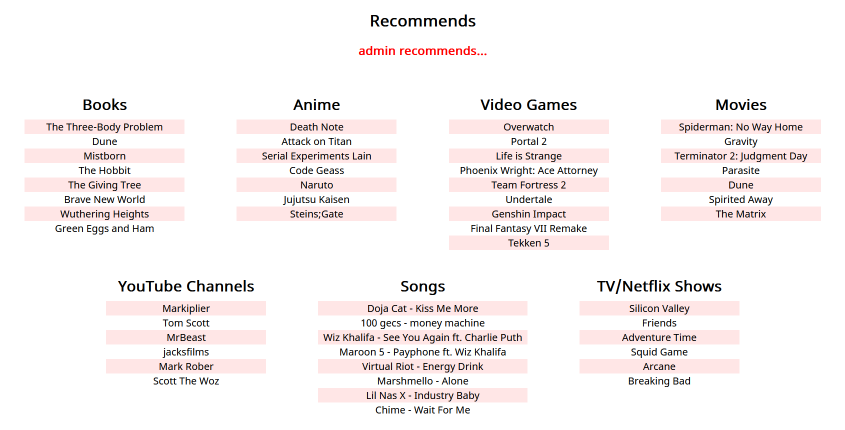

# recommends

A social media site where users can recommend books, movies, etc. to their friends.

By [prydt](https://github.com/prydt) and [NitroGuy](https://github.com/NitroGuy10)



The backend is written in [Python 3](https://www.python.org/) and utilizes
[Flask](https://flask.palletsprojects.com/en/2.1.x/),
[Jinja](https://jinja.palletsprojects.com/en/3.1.x/),
[SQLite](https://www.sqlite.org/index.html),
and [PyNaCl](https://www.sqlite.org/index.html),
and the frontend is written in good ol' HTML, CSS, and JavaScript.

## Install

You'll need [Python 3](https://www.python.org/)

```
# Clone the repository with git (or do it your own way)
git clone https://github.com/prydt/recommends

# Create a virtual environment
python3 -m venv venv

# Activate it (Windows)
venv\Scripts\activate.bat

# Activate it (Mac/Linux)
source venv/bin/activate

# Install the requirements
pip3 install -r requirements.txt
```

## Run

```
# Start the server
python3 app.py
# Now head to http://127.0.0.1:5000/
# And check out http://127.0.0.1:5000/admin for an example (if you're using the default database)

# If you want to create a new database...
# First, delete recommends.db
# Then
python3 create.py
```

